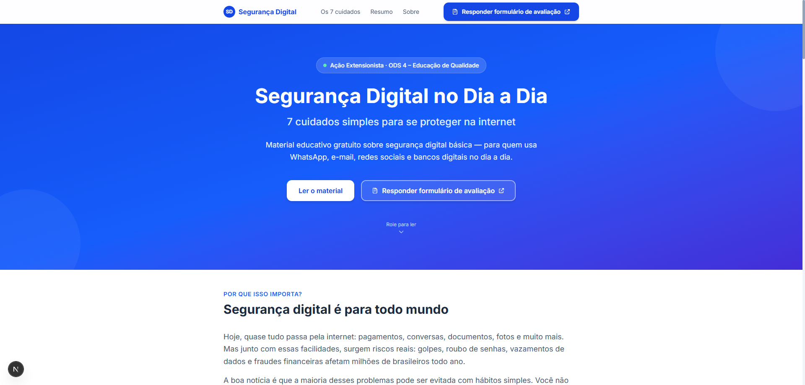

# Segurança Digital no Dia a Dia

> **Ação extensionista acadêmica** — Análise e Desenvolvimento de Sistemas  
> ODS 4 – Educação de Qualidade  
> 🌐 **Site publicado:** [guia-seguranca-digital.vercel.app](https://guia-seguranca-digital.vercel.app/)

Página/cartilha educativa sobre **segurança digital básica**, desenvolvida como ação extensionista para conscientizar pessoas da comunidade sobre como se proteger na internet.

---

## 🖼️ Preview



---

## 📋 Sobre o projeto

Este projeto é uma página web educativa que apresenta **7 cuidados simples de segurança digital** para usuários comuns que utilizam internet, WhatsApp, e-mail, redes sociais e serviços bancários digitais no cotidiano.

O conteúdo foi elaborado com linguagem acessível, sem termos técnicos, para facilitar a compreensão de qualquer pessoa, independentemente do nível de conhecimento em tecnologia.

---

## 🛠️ Tecnologias utilizadas

| Tecnologia | Versão | Finalidade |
|---|---|---|
| Next.js | 16.2.7 | Framework React com App Router |
| React | 19.x | Biblioteca de interface |
| TypeScript | 5.x | Tipagem estática |
| Tailwind CSS | 4.x | Estilização utilitária |

---

## 🚀 Como rodar localmente

### Pré-requisitos

- [Node.js](https://nodejs.org/) versão 18 ou superior
- npm (já vem com o Node.js)

### Instalação

```bash
# 1. Acesse a pasta do projeto
cd seguranca-digital

# 2. Instale as dependências
npm install

# 3. Inicie o servidor de desenvolvimento
npm run dev
```

Acesse no navegador: **http://localhost:3000**

### Build para produção

```bash
npm run build
npm start
```

---

## 🔗 Link do formulário

O link do Google Forms está centralizado em um único arquivo:

```
src/lib/constants.ts
```

O link já está configurado:
```typescript
export const FORM_LINK: string = "https://forms.gle/8iavv76xbcDdtaLK8";
```

Se precisar trocar o link no futuro, edite apenas essa linha. A alteração será refletida automaticamente em todos os botões da página.

### Cuidados de privacidade no formulário

O formulário deve ser simples, voluntário e voltado apenas à avaliação do material educativo. Ele **não deve solicitar**:

- CPF, RG ou documentos pessoais;
- endereço residencial;
- senhas ou códigos de verificação;
- dados bancários ou financeiros;
- informações de saúde;
- qualquer dado sensível ou desnecessário para a avaliação da ação.

Use as sugestões de perguntas em `docs/perguntas-formulario.md` e revise as configurações do Google Forms antes da divulgação.

---

## 📁 Estrutura de pastas

```
seguranca-digital/
├── src/
│   ├── app/
│   │   ├── globals.css        # Estilos globais
│   │   ├── layout.tsx         # Layout raiz + metadados SEO
│   │   └── page.tsx           # Página principal
│   ├── components/
│   │   ├── Navbar.tsx         # Barra de navegação
│   │   ├── Hero.tsx           # Seção inicial (cabeçalho)
│   │   ├── Introduction.tsx   # Introdução ao tema
│   │   ├── TipsSection.tsx    # Seção dos 7 cuidados
│   │   ├── TipCard.tsx        # Card individual de cada cuidado
│   │   ├── Summary.tsx        # Resumo e conclusão
│   │   ├── FormSection.tsx    # Chamada para o formulário
│   │   ├── AboutSection.tsx   # Sobre a ação extensionista
│   │   ├── Footer.tsx         # Rodapé
│   │   ├── FormButton.tsx     # Botão reutilizável do formulário
│   │   └── SectionHeading.tsx # Cabeçalho de seção reutilizável
│   └── lib/
│       └── constants.ts       # ← LINK DO FORMULÁRIO AQUI
├── docs/
│   ├── perguntas-formulario.md   # Sugestões de perguntas para o Forms
│   ├── modelo-divulgacao.md      # Mensagem para WhatsApp
│   └── relatorio-base.md         # Rascunho do relatório final
├── public/
├── README.md
└── package.json
```

---

## 🌐 Como publicar (sugestões)

| Plataforma | Dificuldade | Gratuito | Link |
|---|---|---|---|
| Vercel | ⭐ Muito fácil | ✅ | [vercel.com](https://vercel.com) |
| Netlify | ⭐ Muito fácil | ✅ | [netlify.com](https://netlify.com) |
| GitHub Pages | ⭐⭐ Fácil | ✅ | [pages.github.com](https://pages.github.com) |

**Recomendação**: Use a **Vercel**, pois é a plataforma oficial do Next.js. Basta conectar seu repositório GitHub e o deploy é automático.

---

## 📄 Arquivos de apoio

| Arquivo | Finalidade |
|---|---|
| `docs/perguntas-formulario.md` | Sugestões de perguntas para configurar o Google Forms |
| `docs/modelo-divulgacao.md` | Mensagem pronta para divulgar no WhatsApp |
| `docs/relatorio-base.md` | Rascunho do relatório final da extensão |

---

## 📌 Personalização rápida

| O que mudar | Onde mudar |
|---|---|
| Link do formulário | `src/lib/constants.ts` → `FORM_LINK` |
| Conteúdo dos 7 cuidados | `src/lib/constants.ts` → `TIPS` |
| Nome do curso / instituição | `src/components/AboutSection.tsx` |
| Título e metadados SEO | `src/app/layout.tsx` |

---

## 📜 Licença

Projeto desenvolvido para fins educacionais e extensionistas. Uso livre para fins acadêmicos.
